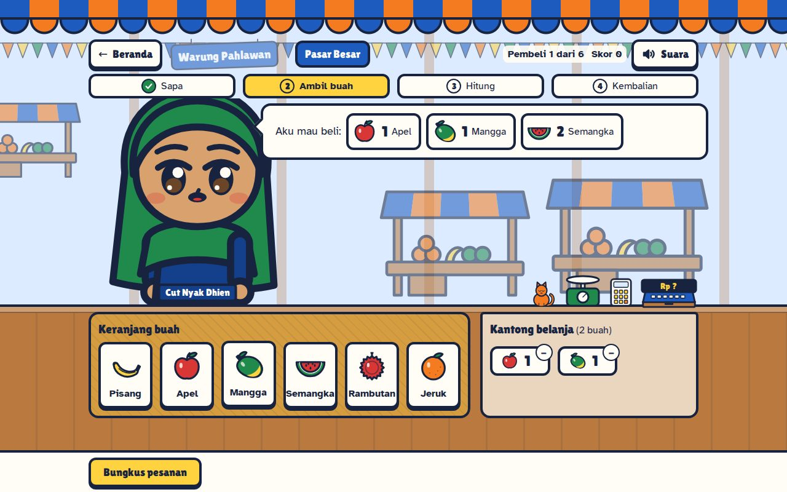
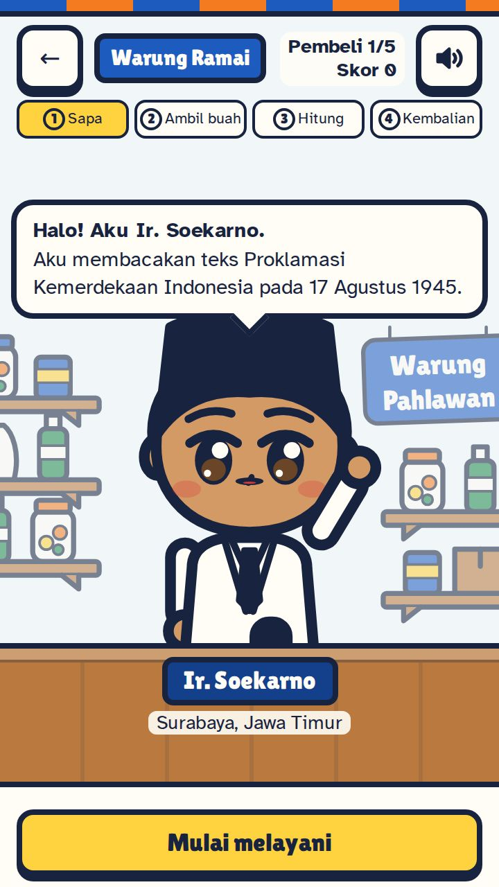

# Warung Pahlawan

Game web untuk anak SD. Anak menjadi penjaga warung buah, dan pembelinya adalah tokoh sejarah Indonesia. Sambil melayani pembeli, anak berlatih berhitung, menghitung kembalian, dan bekerja teliti langkah demi langkah, serta mengenal para pahlawan.

Dibuat untuk M-ONE Telkomsel Coding Competition 2026, Kategori Umum, tema "Innovating Education Through Technology", subtema Web Education for Kids.

**Situs: https://wp.itslim.dev**

<p>
  
  
</p>
<p>
  
</p>

## Fitur

- **Tiga level warung**, semuanya bisa langsung dipilih dari beranda:
  - Warung Kecil: 4 pembeli, 1 jenis buah per pesanan, total sudah dihitung di nota.
  - Warung Ramai: 5 pembeli, 2 jenis buah, hasil kali tiap baris dibantu.
  - Pasar Besar: 6 pembeli, 3 jenis buah, tanpa bantuan.
- **Empat langkah melayani satu pembeli**, dengan penanda urutan langkah di atas layar:
  1. Sapa: tokoh datang dan membagikan satu fun fact.
  2. Ambil buah: ketuk buah di keranjang, keluarkan lagi kalau kelebihan, lalu bungkus. Kalau belum pas, game menyebut buah yang kurang atau lebih.
  3. Hitung: pilih total belanja dari tiga pilihan.
  4. Kembalian: susun kembalian dari laci uang, atau pilih "Tidak perlu kembalian" kalau uangnya pas.
- **Delapan tokoh pembeli:** R.A. Kartini, Ir. Soekarno, Mohammad Hatta, Ki Hajar Dewantara, Cut Nyak Dhien, Pangeran Diponegoro, Jenderal Sudirman, dan Kapitan Pattimura. Masing-masing punya dua fun fact dari [docs/sumber-fakta.md](docs/sumber-fakta.md).
- **Skor dan bintang.** Tiap pembeli bernilai 10 poin, dikurangi 2 untuk tiap kesalahan (paling sedikit 4). Bintang terbaik tiap level disimpan di browser. Game tetap jalan kalau penyimpanan browser tidak tersedia.
- **Riwayat main.** Tiap permainan yang selesai dicatat di browser (paling banyak 50 terakhir, hanya data skor). Beranda menampilkan lima permainan terakhir, dan halaman "Semua riwayat" menampilkan semuanya beserta skor tertinggi dan bintang terbaik tiap level. Riwayat bisa dihapus tanpa menghapus bintang terbaik.
- **Layar hasil** menampilkan skor, bintang, dan daftar tokoh yang dilayani beserta fun fact-nya. Kalau skornya melewati rekor level itu, muncul lencana "Skor tertinggi baru!" beserta perbandingan dengan permainan sebelumnya. Kalau ada level berikutnya, tombol utamanya "Lanjut ke" level itu; anak juga bisa main lagi atau kembali ke beranda.
- **Keluar di tengah permainan.** Tombol ← dan tombol kembali browser membuka dialog "Tutup warung sekarang?" (skor level itu belum tersimpan), dengan pilihan "Lanjut main" dan "Tutup warung".
- **Suasana warung di layar main:**
  - Pembeli digambar setengah badan, berdiri tepat di belakang meja kasir dengan kedua tangan bertumpu di tepi meja. Lengannya melengkung dengan siku, manset, dan tangan bersarung bulat dengan jempol.
  - Pembeli berjalan masuk dan keluar dengan tampak samping, lalu berputar menghadap depan (berganti tampak dengan crossfade). Tombol "Mulai melayani" baru muncul setelah ia diam menghadap depan.
  - Setelah kembalian benar, bungkusan belanja dan uang kembalian berpindah dari meja ke tangan pembeli, lalu poin (misalnya "+10") muncul sebentar di dekat skor. Pembeli membawa bungkusan itu saat pergi.
  - Keranjang buah, kantong belanja, nota, laci uang, nampan kembalian, dan mesin kasir ada di atas meja.
  - Tiap level punya latar sendiri: warung kayu, warung ramai, dan los pasar.
  - Mesin kasir warung model lama berdiri di sisi kanan meja: layar miring, deretan tombol, laci uang, dan gulungan kertas nota di atasnya. Layarnya menulis "Rp ?" sampai total diketahui, lalu total belanja (di level 2 dan 3 setelah anak memilih total yang benar).
  - Mesin kasir hanya bergerak sebagai jawaban atas aksi anak: setelah pesanan dibungkus tombolnya berkedip bergantian dan kertas nota keluar dari atas, lalu di langkah Kembalian lacinya terbuka memperlihatkan uang dan menutup lagi setelah kembalian benar.
- **Layar loading "Membuka warung":**
  - Saat level dipilih, pintu gulung warung yang tertutup langsung tampil, dengan papan nama level.
  - Pintu baru naik setelah latar, meja kasir, karakter pembeli, animasi, dan font siap, jadi warung tampil utuh. Setelah itu pembeli pertama berjalan masuk.
  - Kalau gagal dimuat atau lebih dari 8 detik, muncul pesan ramah dengan tombol "Coba lagi" dan "Kembali".
  - Layar hasil memakai pintu yang sama.
  - Beranda memuat berkas level lebih dulu saat browser senggang dan saat kartu level disentuh atau difokus.
- **Efek suara** dari rekaman berlisensi CC0 (paket Kenney dan Freesound), diputar lewat Web Audio API:
  - Ada bunyi pintu gulung naik, lonceng pintu saat pembeli masuk, dan langkah kaki yang selaras dengan ayunan langkah. Ada juga buah masuk dan keluar kantong, pesanan dibungkus, tombol dan laci mesin kasir, uang kertas dan koin, jawaban benar, jawaban salah yang lembut, dan fanfare di layar hasil.
  - Berkas suara (15 berkas MP3, 112 kB) baru dimuat setelah sentuhan pertama anak, bukan saat halaman dibuka. Kalau berkas belum siap atau gagal dimuat, bunyi buatan Web Audio dipakai sebagai cadangan.
  - Tombol Suara ada di beranda dan layar main. Suara berhenti saat tab tersembunyi, dan setiap bunyi selalu disertai umpan balik di layar.
  - Semua bunyi bisa didengarkan di halaman tersembunyi `/?sfx`.
- **Beranda** menjelaskan cara main dan apa yang dilatih (berhitung, uang rupiah, teliti dan runtut, kenal pahlawan) dalam bahasa anak.
- **Bisa dipakai dengan sentuhan, mouse, dan keyboard:**
  - Umpan balik selalu berupa teks dan diumumkan untuk pembaca layar.
  - Target sentuh minimal 48 px.
  - Animasi mengikuti pengaturan "kurangi gerakan".
  - Di HP, tombol aksi selalu terlihat di bawah layar, dan tombol "Buka warung" di beranda terlihat tanpa menggeser layar (360×640).
  - Di layar lebar (1024 px ke atas) tata letaknya dua kolom: pembeli dan balon bicara di kiri, area kerja dan tombol di kanan.
- **Ilustrasi buatan sendiri.** Semua ilustrasi (buah, uang, tokoh) adalah SVG buatan sendiri. Desain uang tidak meniru uang rupiah asli.

## Menjalankan di komputer sendiri

Butuh Node.js 24. Versinya juga tertulis di `.nvmrc`, jadi kalau memakai nvm cukup jalankan `nvm use`.

```bash
npm install      # pasang dependency
npm run dev      # jalankan server pengembangan, lalu buka alamat yang muncul
npm test         # jalankan tes logika game (Vitest)
npm run lint     # periksa kode (oxlint)
npm run build    # buat versi siap deploy di folder dist
npm run preview  # coba hasil build di komputer sendiri
```

## Stack

- React dan Vite, JavaScript tanpa TypeScript
- Tailwind CSS 4 lewat plugin Vite resminya; token warna dan font ada di `src/index.css`
- Font Lilita One dan Atkinson Hyperlegible, dimuat lokal lewat Fontsource
- Motion untuk animasi pembeli dan karakter (dimuat ringan lewat `LazyMotion`)
- Vitest untuk tes logika game; oxlint untuk pemeriksaan kode
- Hosting di Vercel, deploy otomatis dari branch `main`

## Struktur singkat

- `src/data/`: isi game (tokoh, buah, uang, level, teks panduan)
- `src/game/`: logika game sebagai fungsi murni beserta tesnya
- `src/lib/`: modul kecil di luar logika game (efek suara, layar mesin kasir) beserta tesnya
- `src/components/` dan `src/screens/`: tampilan; latar warung ada di `src/components/scene/`
- Penjelasan lengkap ada di [AGENTS.md](AGENTS.md), bagian 7.

## Keterbatasan yang diketahui

- Di layar HP, isi meja kasir perlu digeser di beberapa keadaan, misalnya kantong berisi banyak jenis buah atau nampan berisi banyak uang. Saat itu muncul tanda "Geser ke bawah".
- Di layar laptop yang pendek (tinggi jendela di bawah sekitar 800 px), pembeli digambar lebih kecil supaya balon bicara tidak menimpa kepala, dan isi meja bisa perlu digeser di keadaan yang ramai (misalnya kantong berisi semua jenis buah).
- Uji di HP asli belum tercatat di repo. Pengecekan dilakukan di browser dengan ukuran layar HP.

## Kredit aset

Semua efek suara adalah rekaman berlisensi CC0 dari Kenney (kenney.nl) dan Freesound. Nama berkas, judul asli, pembuat, tautan sumber, dan lisensinya ada di [docs/kredit-aset.md](docs/kredit-aset.md).

## Dokumen

- [AGENTS.md](AGENTS.md): docs acuan untuk AI Agent, berisi tujuan, alur game, aturan kerja, desain, dan status tugas.
- [docs/jurnal-prompt.md](docs/jurnal-prompt.md): lima prompt terkurasi untuk juri.
- [docs/prompt-log.md](docs/prompt-log.md): log prompt mentah dari awal sampai akhir.
- [docs/sumber-fakta.md](docs/sumber-fakta.md): teks dan sumber tiap fun fact tokoh.
- [docs/audit.md](docs/audit.md): hasil audit performa, aksesibilitas, dan SEO, sebelum dan sesudah.
- [docs/kredit-aset.md](docs/kredit-aset.md): asal dan lisensi efek suara.
