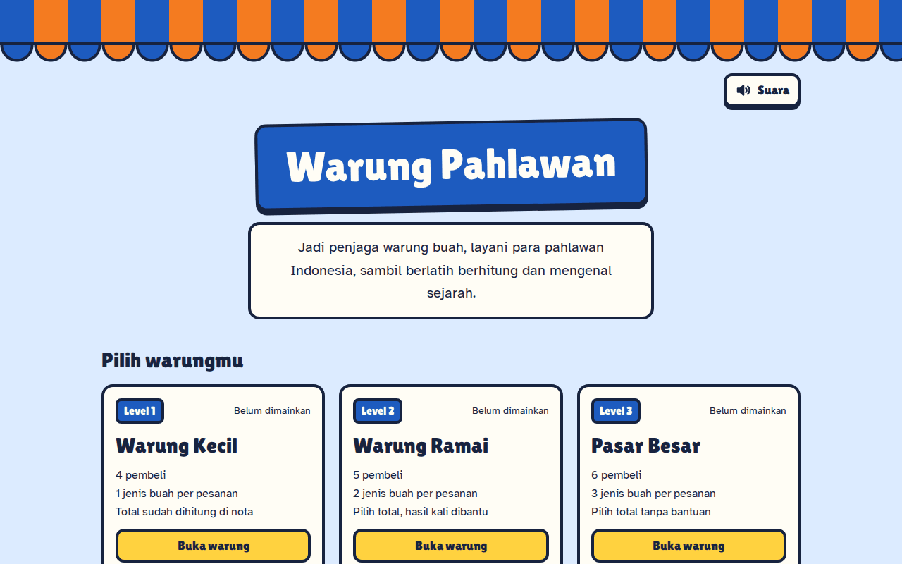
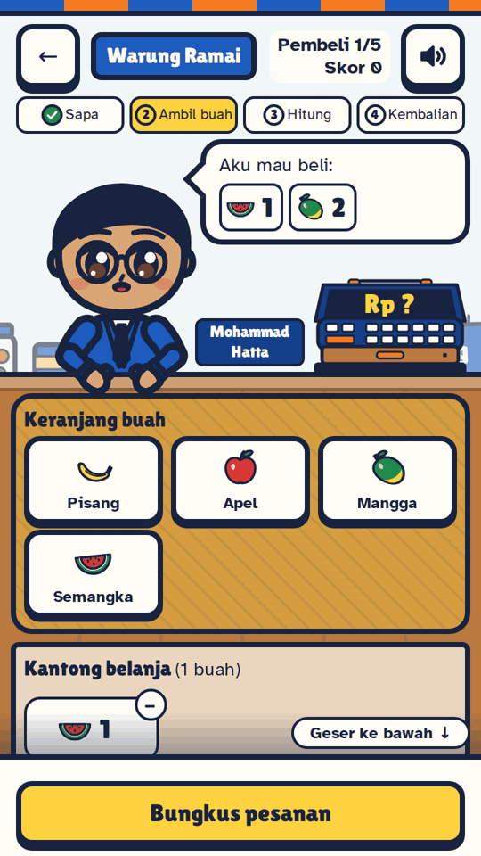
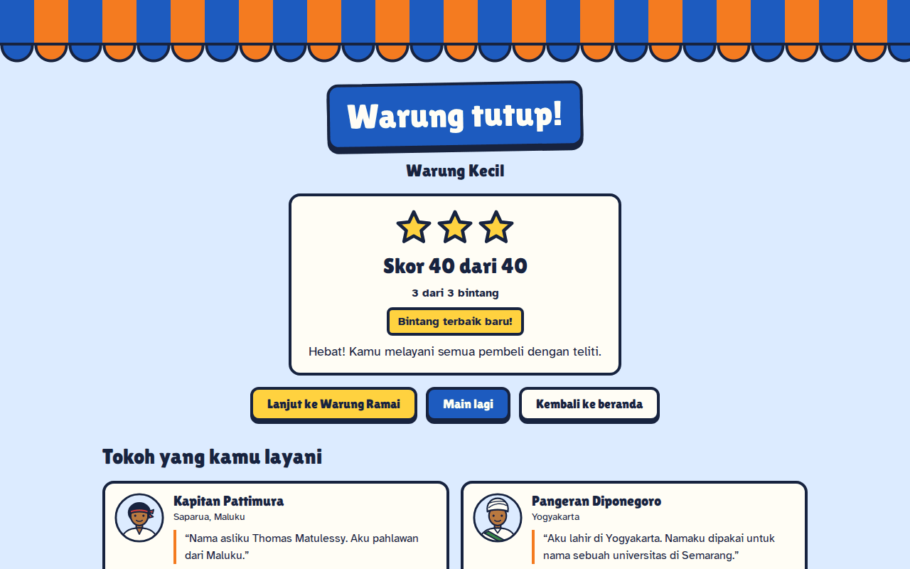

# Warung Pahlawan

Game web untuk anak SD: jaga warung buah, layani tokoh pahlawan Indonesia, dan berlatih berhitung serta menghitung kembalian.

**Situs: https://wp.itslim.dev**

Dibuat untuk M-ONE Telkomsel Coding Competition 2026, Kategori Umum, tema "Innovating Education Through Technology", subtema Web Education for Kids.

## Screenshot

<p>
  
</p>
<p>
  
  
</p>

## Fitur

- **Tiga level**, semuanya bisa langsung dipilih:
  - Warung Kecil: 4 pembeli, 1 jenis buah per pesanan, total sudah dihitung di nota.
  - Warung Ramai: 5 pembeli, 2 jenis buah, hasil kali tiap baris dibantu.
  - Pasar Besar: 6 pembeli, 3 jenis buah, tanpa bantuan.
- **Empat langkah permainan** untuk tiap pembeli: Sapa, Ambil buah, Hitung, dan Kembalian, dengan penanda langkah di atas layar.
- **Delapan tokoh pembeli** (R.A. Kartini, Ir. Soekarno, Mohammad Hatta, Ki Hajar Dewantara, Cut Nyak Dhien, Pangeran Diponegoro, Jenderal Sudirman, Kapitan Pattimura), masing-masing dengan dua fun fact bersumber dari [docs/sumber-fakta.md](docs/sumber-fakta.md).
- **Karakter beranimasi:** pembeli berjalan masuk, berputar menghadap depan, melambai, bernapas dan berkedip saat diam, menerima bungkusan, lalu berjalan keluar.
- **Efek suara dan tombol Suara:** rekaman berlisensi CC0 untuk pintu, lonceng, langkah kaki, buah, mesin kasir, uang, jawaban, dan fanfare. Tombol Suara ada di beranda dan layar main.
- **Bintang dan riwayat skor:** skor dan bintang tiap level, bintang terbaik di kartu level, dan riwayat 50 permainan terakhir di browser. Beranda menampilkan lima permainan terakhir, dan halaman "Semua riwayat" menampilkan semuanya beserta ringkasan tiap level. Layar hasil memberi tahu kalau ada skor tertinggi baru.
- **Layar loading** berupa pintu gulung warung yang baru naik setelah semua bagian layar siap.
- **Tampilan HP dan desktop:** di HP tombol aksi selalu terlihat di bawah layar; di layar lebar (1024 px ke atas) tampilannya dua kolom.
- **Bisa dipakai dengan sentuhan, mouse, dan keyboard.** Umpan balik selalu berupa teks dan diumumkan untuk pembaca layar, dan animasi mengikuti pengaturan "kurangi gerakan".

## Cara main

1. **Sapa:** baca cerita tokoh yang datang ke warungmu.
2. **Ambil buah:** ketuk buah sesuai pesanan, lalu bungkus.
3. **Hitung:** tentukan berapa total belanjanya.
4. **Kembalian:** susun kembalian dari laci uang.

Tiap pembeli bernilai 10 poin, dikurangi 2 untuk tiap kesalahan (paling sedikit 4).

## Stack

- React 19 dan Vite 8, JavaScript tanpa TypeScript
- Tailwind CSS 4 lewat plugin Vite resminya
- Motion untuk animasi karakter
- Font Lilita One dan Atkinson Hyperlegible lewat Fontsource
- Vitest untuk tes, oxlint untuk pemeriksaan kode
- Vercel untuk hosting

## Cara menjalankan

Butuh Node.js 24 (tertulis di `.nvmrc`).

```bash
nvm install     # kalau memakai nvm: pasang Node.js sesuai .nvmrc
nvm use         # pakai versi itu
npm install     # pasang dependency
npm run dev     # server pengembangan
npm test        # jalankan tes
npm run lint    # periksa kode
npm run build   # buat versi siap deploy di folder dist
```

## Struktur folder

```
src/data/        isi game: tokoh, buah, uang, level, teks panduan
src/game/        logika game sebagai fungsi murni beserta tesnya
src/lib/         modul di luar logika game: efek suara, riwayat skor, mesin kasir
src/components/  potongan tampilan, termasuk karakter dan latar warung
src/screens/     satu berkas per layar
public/          favicon, gambar pratinjau, efek suara, robots.txt, sitemap.xml
docs/            dokumen proyek dan screenshot README (docs/img)
```

## Dokumen proyek

- [AGENTS.md](AGENTS.md): docs acuan untuk AI Agent
- [docs/jurnal-prompt.md](docs/jurnal-prompt.md): lima prompt terkurasi
- [docs/prompt-log.md](docs/prompt-log.md): log prompt mentah dari awal sampai akhir
- [docs/sumber-fakta.md](docs/sumber-fakta.md): teks dan sumber tiap fun fact
- [docs/kredit-aset.md](docs/kredit-aset.md): asal dan lisensi efek suara
- [docs/audit.md](docs/audit.md): hasil audit aksesibilitas, performa, dan SEO

## Kredit aset

Efek suara adalah rekaman berlisensi CC0 dari Kenney dan Freesound (rinciannya di [docs/kredit-aset.md](docs/kredit-aset.md)), dan font Lilita One serta Atkinson Hyperlegible memakai lisensi SIL Open Font License 1.1.
